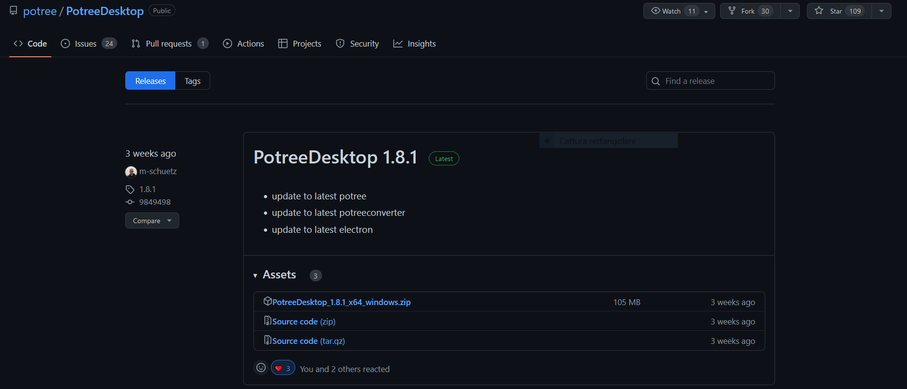
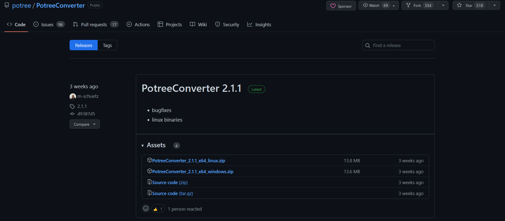

..
    this is a title

Potree
==================

**Potree** is a *free open-source WebGL* based point cloud renderer for large point clouds, developed at the Institute of Computer Graphics and Algorithms, TU Wien, Austria.
There are 3 ways for accessing Potree:

* **Potree Desktop**: Desktop version of Potree. Allows drag&drop of point clouds into the viewer (https://github.com/potree/PotreeDesktop/releases)
* **Potree Converter**: Convert your point cloud to the Potree format (https://github.com/potree/PotreeConverter/releases)
* **Potree Develop**: Edit and develop several potree examples (https://github.com/potree/potree/)

Potree Desktop
--------------

A desktop/portable version of the web-based point cloud viewer Potree, thanks to Electron.
This versione allows you to load converted point clouds from your hard disk or external drive. It’s also portable, so you can put your models together with the viewer on a USB drive and open it wherever you go.
It’s only been tested on Windows at the moment. It may not work on other systems or you may only be able to use it on the same Operating System that you’ve initially built it on.
You can also drag&drop cloud.js files into the window to add point clouds to the scene.

Getting started
+++++++++++++++

Download the Potree ,zip files for Windows from this link: https://github.com/potree/PotreeDesktop/releases

Graphic User Interface
++++++++++++++++++++++

Once you downloaded the installer .zip, extract all the files and execute PotreeDesktop.bat. Then, a new window will appear with the main Graphic User Interface of Potree.

.. image:: img/potree-desktop-gui.PNG
  :align: center
  :alt: Potree Desktop Release installer page

The Potree GUI is made of 2 components:

* **Sidebar**: on the left, it includes all the main features and tools for point-clouds elaborations in the Potree environment.
* **Viewer**: on the right, it is the actual space for visually exploring and navigating the point-clouds.

// UNDER CONSTRUCTION //

Potree Converter
----------------

PotreeConverter generates an octree LOD structure for streaming and real-time rendering of massive point clouds. The results can be viewed in web browser with Potree.
The conversion operation produces a total of 3 files, with better support for standard LAS attributes and arbitrary extra attributes.

Getting started
+++++++++++++++

Download and extract the PotreeConverter files for Windwos from this link: https://github.com/potree/PotreeConverter/releases

Be sure that the PotreeConverter.exe is present inside the unzipped folder.

..
    add a note box

.. note:: For making easier the conversion process, it is suggested to copy and paste in the unzipped PotreeConverter folder the pointcloud to be converted in a .las/.laz format.

Publications
++++++++++++

* `Potree: Rendering Large Point Clouds in Web Browsers. <https://www.cg.tuwien.ac.at/research/publications/2016/SCHUETZ-2016-POT/SCHUETZ-2016-POT-thesis.pdf>`__
* `Fast Out-of-Core Octree Generation for Massive Point Clouds <https://www.cg.tuwien.ac.at/research/publications/2020/SCHUETZ-2020-MPC/>`__, Schütz M., Ohrhallinger S., Wimmer M.

Potree Develop
--------------

to be written

